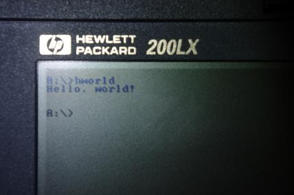

# hp200lx-apps

Various small programs I've written for the HP 200LX.

Hopefully this will eventually include useful things.

## Build System & Toolchain

Notable make tasks:

- `make all` &mdash; builds all executables.
- `make bin/$X.exe` &mdash; builds the project in `./$X` as `bin/$X.exe`.
- `make clean` &mdash; removes build artifacts.
- `make copy` &mdash; copy everything from bin/ to `${OUTDIR}`.
- `make tools` &mdash; install the toolchain.
- `make update-tools` &mdash; removes the toolchain, then installs the latest version.

The toolchain is [Open Watcom V2](https://github.com/open-watcom/open-watcom-v2/),
and should be automatically pulled in when you build it.

Currently, you need at least GNU Make, sh, file, grep, cut, and xargs to
install the toolchain automatically.

## License

All code is released under the MIT license.
